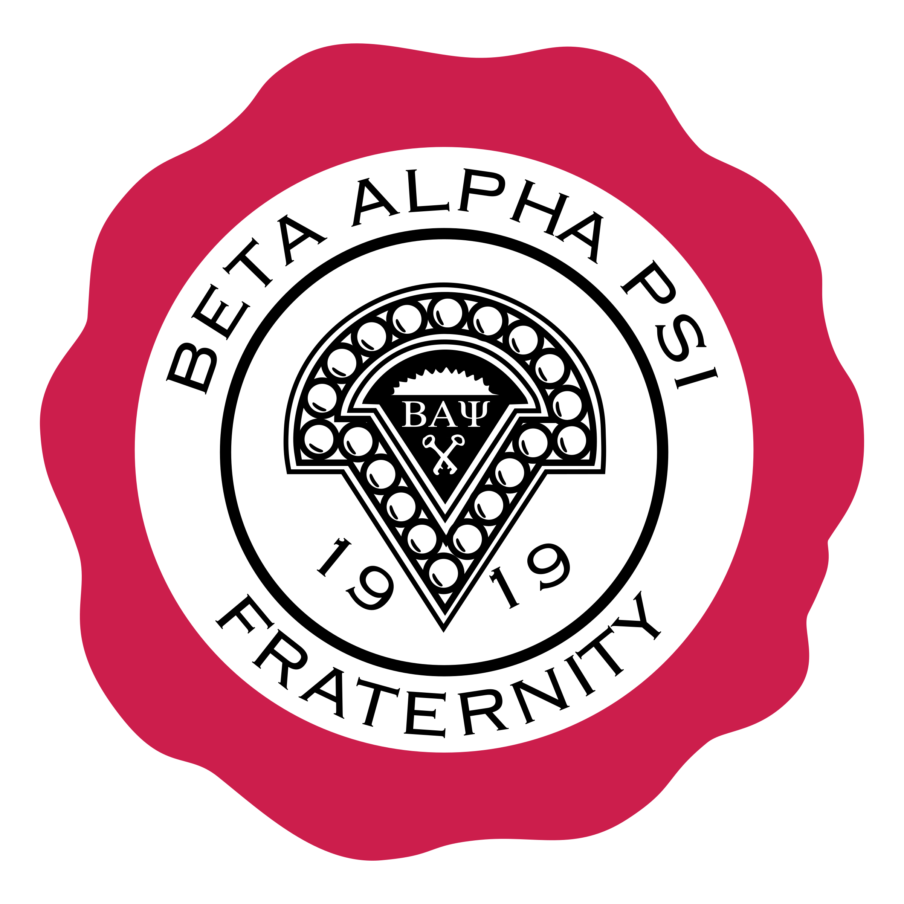

<div id="top">

<!-- HEADER STYLE: CLASSIC -->
<div align="center">



# NUANSWERS

<em>Transforming Knowledge into Instant, Intelligent Answers</em>

<!-- BADGES -->


<em>Built with the tools and technologies:</em>


<br>


</div>
<br>

---

## 📄 Table of Contents

- [Overview](#-overview)
- [Getting Started](#-getting-started)
    - [Prerequisites](#-prerequisites)
    - [Installation](#-installation)
    - [Usage](#-usage)
    - [Testing](#-testing)
- [Features](#-features)
- [Project Structure](#-project-structure)
    - [Project Index](#-project-index)
- [Roadmap](#-roadmap)
- [Contributing](#-contributing)
- [License](#-license)
- [Acknowledgment](#-acknowledgment)

---

## ✨ Overview

NuAnswers is an AI-powered platform that transforms document uploads into intelligent, context-aware answers, enabling seamless knowledge access. Designed for developers, it offers a scalable, secure environment to deploy AI-driven Q&A and document processing applications. The core features include:

- 🧩 **🔧 Deployment Configuration:** Facilitates seamless, secure deployment of a Streamlit-based chatbot platform with multi-domain support.
- 🚀 **🤖 AI Integration:** Connects with OpenAI models to generate contextual, accurate responses from uploaded documents.
- 📁 **📄 Document Processing:** Supports diverse file uploads, transforming static content into interactive insights.
- 🛡️ **🔒 Security & Compliance:** Implements comprehensive security headers and health checks to safeguard the platform.
- 🧑‍💻 **🧑‍💼 Admin Dashboard:** Provides tools for system oversight, management, and analytics.
- 💬 **🌐 User Engagement:** Features intuitive UI components, contact pages, and legal info to enhance user trust.

### 🎓 Intelligent Tutoring Features
- Step-by-step guidance through problems
- Encourages critical thinking
- Avoids giving direct answers
- Personalized learning experience
- Supports accounting, finance, and related topics

### 📚 Document Support
- Upload and process various file formats:
  - PDF documents
  - Word documents (DOCX)
  - Text files (TXT)
  - PowerPoint presentations (PPTX)
  - Excel spreadsheets (XLS, XLSX)
  - CSV files
  - Images (PNG, JPG, JPEG) with AI-powered analysis
- Intelligent image analysis for:
  - Screenshots of problems or equations
  - Charts and graphs
  - Handwritten notes
  - Financial statements
  - Business diagrams
- Search within uploaded documents
- Manage and reorder documents
- Context-aware tutoring based on uploaded materials

### ⏰ Smart Availability
- Automatically manages access based on in-person tutoring hours
- Encourages in-person tutoring during scheduled sessions
- Available 24/7 outside of tutoring hours

### 📊 Advanced Analytics Dashboard
#### Overview Metrics
- Total registrations and unique students
- Total and average usage time
- Return user analysis and retention rates
- Real-time system performance metrics
- Department-specific analytics

#### Time-Based Analytics
- Daily and weekly usage patterns
- Peak usage times heatmap
- Session duration analysis
- Hourly distribution of activity
- Time zone-aware analytics (EST)
- Historical trend analysis

#### Academic Performance Metrics
- Grade level progression analysis
- Major and course distribution
- Cross-analysis of academic factors
- Professor engagement statistics
- Course success rates
- Department performance comparisons
- Semester-to-semester comparisons
- Year-over-year growth analysis

#### User Engagement Analysis
- Session frequency patterns
- Time between sessions analysis
- Return user behavior
- User retention statistics
- Engagement metrics by demographic
- Usage patterns by academic level
- Student success prediction
- Usage forecasting

#### Demographic Analysis
- Student demographics distribution
- Department and major analysis
- Campus-specific metrics
- Grade level distribution
- Cross-demographic analysis
- Usage patterns by demographic

#### System Performance Metrics
- Response time analysis
- Error rate monitoring
- System uptime tracking
- Performance trends
- Resource utilization
- Peak load analysis

#### Content Analysis
- Topic popularity and trends
- Content engagement metrics
- Resource utilization patterns
- Search term analysis
- Document access patterns
- Content effectiveness metrics

#### Feedback and Quality Metrics
- User satisfaction tracking
- Response quality analysis
- Resolution time metrics
- Service improvement tracking
- Quality trend analysis
- User feedback patterns

#### Predictive Analytics
- Usage forecasting
- Peak time predictions
- Student success prediction
- Growth trend analysis
- Resource demand forecasting
- Performance optimization insights

#### Custom Reports and Exports
- Date range analysis
- Department-specific reports
- Custom metric selection
- Scheduled report generation
- Multiple export formats (CSV, Excel)
- Interactive data filtering
- Real-time report generation
- Automated report delivery

#### Data Management
- Secure data clearing options
- Individual data type management
- Bulk data operations
- Data backup and restore
- Data validation and integrity checks
- Audit logging

---

## 📌 Features

|      | Component            | Details                                                                                     |
| :--- | :------------------- | :------------------------------------------------------------------------------------------ |
| ⚙️  | **Architecture**      | <ul><li>Modular monolith with clear separation between frontend (Next.js, React, TypeScript) and backend (Python, Streamlit)</li><li>Client-server architecture leveraging REST APIs and server-side rendering</li></ul> |
| 🔩 | **Code Quality**      | <ul><li>TypeScript strict typing, enforced via `tsconfig.json`</li><li>Python code adheres to PEP8 standards, with requirements managed via `requirements.txt`</li><li>Codeowners file for ownership and review process</li></ul> |
| 📄 | **Documentation**     | <ul><li>Comprehensive README with project overview, setup instructions, and usage</li><li>Documentation generated via markdown and inline comments</li><li>Config files like `render.yaml` suggest deployment and rendering instructions</li></ul> |
| 🔌 | **Integrations**      | <ul><li>Package dependencies include `openai`, `plotly`, `pandas`, `beautifulsoup4`, `python-docx`, `PyPDF2`, `python-pptx`, `streamlit`</li><li>CI/CD pipelines utilizing `npm` and `pip` for build and dependency management</li><li>React ecosystem with `@emotion/react`, `@mui/material`, `react-dom`, `next`</li></ul> |
| 🧩 | **Modularity**        | <ul><li>Frontend components modularized with React and TypeScript, styled with Emotion</li><li>Backend functions organized into Python modules, enabling reuse and testing</li><li>Separation of concerns between data processing, UI, and API layers</li></ul> |
| 🧪 | **Testing**           | <ul><li>Testing frameworks not explicitly listed, but dependencies like `pytest` likely used in Python</li><li>Potential unit tests for Python modules and component testing for React components</li><li>CI/CD pipelines suggest automated testing integration</li></ul> |
| ⚡️  | **Performance**       | <ul><li>Client-side rendering with Next.js optimizations</li><li>Use of efficient data handling libraries (`pandas`, `plotly`) for visualization</li><li>Streamlit for rapid data app deployment, optimized for quick rendering</li></ul> |
| 🛡️ | **Security**          | <ul><li>Code ownership and review process via `codeowners`</li><li>Dependency management with specific versions to prevent vulnerabilities</li><li>Potential security measures in deployment pipelines (not explicitly detailed)</li></ul> |
| 📦 | **Dependencies**      | <ul><li>Python: `requirements.txt` includes `openai`, `pandas`, `beautifulsoup4`, `python-docx`, `PyPDF2`, `python-pptx`, `streamlit`</li><li>JavaScript/TypeScript: `package.json` manages React, Next.js, MUI, Emotion, Plotly, and types</li></ul> |

---

## 📁 Project Structure

```sh
└── NuAnswers/
    ├── .github
    │   └── CODEOWNERS
    ├── CISCO_UMBRELLA_REVIEW.md
    ├── LICENSE
    ├── NuAnswers.py
    ├── NuAnswers.py.bak
    ├── README.md
    ├── components
    │   └── Footer.tsx
    ├── package-lock.json
    ├── package.json
    ├── pages
    │   ├── 1_👨‍💼_Admin.py
    │   ├── contact.html
    │   ├── contact.tsx
    │   ├── legal
    │   ├── privacy-policy.html
    │   └── terms-of-service.html
    ├── public
    │   ├── .well-known
    │   ├── robots.txt
    │   └── sitemap.xml
    ├── render.yaml
    ├── requirements.txt
    ├── security_headers.py
    ├── static
    │   └── robots.txt
    └── tsconfig.json
```

---

### 📑 Project Index

<details open>
	<summary><b><code>NUANSWERS/</code></b></summary>
	<!-- __root__ Submodule -->
	<details>
		<summary><b>__root__</b></summary>
		<blockquote>
			<div class='directory-path' style='padding: 8px 0; color: #666;'>
				<code><b>⦿ __root__</b></code>
			<table style='width: 100%; border-collapse: collapse;'>
			<thead>
				<tr style='background-color: #f8f9fa;'>
					<th style='width: 30%; text-align: left; padding: 8px;'>File Name</th>
					<th style='text-align: left; padding: 8px;'>Summary</th>
				</tr>
			</thead>
				<tr style='border-bottom: 1px solid #eee;'>
					<td style='padding: 8px;'><b><a href='https://github.com/BAPNuSigma/NuAnswers/blob/master/render.yaml'>render.yaml</a></b></td>
					<td style='padding: 8px;'>- Defines deployment configuration for the NuAnswers web application, orchestrating its environment, build, and runtime settings<br>- Facilitates seamless deployment of a Streamlit-based chatbot platform that integrates OpenAI API capabilities, ensuring secure, scalable access across multiple domains while maintaining essential security headers and health checks within the overall architecture.</td>
				</tr>
				<tr style='border-bottom: 1px solid #eee;'>
					<td style='padding: 8px;'><b><a href='https://github.com/BAPNuSigma/NuAnswers/blob/master/NuAnswers.py'>NuAnswers.py</a></b></td>
					<td style='padding: 8px;'>- NuAnswers.pyThis file serves as the core interface for the NuAnswers application, enabling users to interact with a comprehensive document processing and question-answering system<br>- It orchestrates the user interface, manages file uploads of various document formats, and integrates with OpenAIs language models to generate contextual answers<br>- Overall, NuAnswers.py facilitates seamless user engagement with diverse data sources, transforming uploaded content into intelligent, accessible insights within a streamlined web application.</td>
				</tr>
				<tr style='border-bottom: 1px solid #eee;'>
					<td style='padding: 8px;'><b><a href='https://github.com/BAPNuSigma/NuAnswers/blob/master/package.json'>package.json</a></b></td>
					<td style='padding: 8px;'>- Defines the projects core configuration and dependencies for the NuAnswers application, establishing the foundation for development, building, and deployment processes<br>- It ensures consistent setup across environments, manages essential libraries like React, Next.js, and Material UI, and facilitates streamlined development workflows within the overall architecture.</td>
				</tr>
				<tr style='border-bottom: 1px solid #eee;'>
					<td style='padding: 8px;'><b><a href='https://github.com/BAPNuSigma/NuAnswers/blob/master/LICENSE'>LICENSE</a></b></td>
					<td style='padding: 8px;'>- Defines licensing terms and legal usage guidelines for the project, ensuring proper attribution and distribution compliance within the overall architecture<br>- It establishes the legal framework that governs how the codebase can be shared, modified, and integrated, supporting open-source collaboration and safeguarding intellectual property rights.</td>
				</tr>
				<tr style='border-bottom: 1px solid #eee;'>
					<td style='padding: 8px;'><b><a href='https://github.com/BAPNuSigma/NuAnswers/blob/master/CISCO_UMBRELLA_REVIEW.md'>CISCO_UMBRELLA_REVIEW.md</a></b></td>
					<td style='padding: 8px;'>- Provides detailed instructions for submitting a domain categorization review request to Cisco Umbrella, ensuring the educational and legitimate status of nuanswers.org is verified<br>- Facilitates communication with Cisco support, streamlining the review process to prevent unnecessary blocking and maintain secure, accessible access to the site.</td>
				</tr>
				<tr style='border-bottom: 1px solid #eee;'>
					<td style='padding: 8px;'><b><a href='https://github.com/BAPNuSigma/NuAnswers/blob/master/tsconfig.json'>tsconfig.json</a></b></td>
					<td style='padding: 8px;'>- Defines TypeScript compiler options to ensure consistent, strict, and optimized code compilation across the project<br>- It establishes the target environment, module resolution, and library inclusions, supporting seamless development and build processes within the overall architecture<br>- This configuration underpins reliable type safety and compatibility for the entire codebase.</td>
				</tr>
				<tr style='border-bottom: 1px solid #eee;'>
					<td style='padding: 8px;'><b><a href='https://github.com/BAPNuSigma/NuAnswers/blob/master/security_headers.py'>security_headers.py</a></b></td>
					<td style='padding: 8px;'>- Defines and applies comprehensive security headers to HTTP responses, enhancing web application protection against common vulnerabilities such as MIME sniffing, clickjacking, XSS, and mixed content<br>- It establishes security policies, enforces HTTPS, and signals trustworthiness, thereby strengthening the overall security posture and integrity of the web platform within the project architecture.</td>
				</tr>
				<tr style='border-bottom: 1px solid #eee;'>
					<td style='padding: 8px;'><b><a href='https://github.com/BAPNuSigma/NuAnswers/blob/master/README.md'>README.md</a></b></td>
					<td style='padding: 8px;'>- Provides the core functionality for NuAnswers, an AI-powered tutoring platform that delivers personalized, step-by-step guidance in accounting and finance<br>- It manages user interactions, document uploads, and AI analysis, enabling context-aware tutoring and document search<br>- This component integrates AI features, user management, and analytics to support an intelligent, secure, and scalable educational experience.</td>
				</tr>
				<tr style='border-bottom: 1px solid #eee;'>
					<td style='padding: 8px;'><b><a href='https://github.com/BAPNuSigma/NuAnswers/blob/master/requirements.txt'>requirements.txt</a></b></td>
					<td style='padding: 8px;'>- Defines project dependencies essential for building an interactive data analysis and visualization platform<br>- It ensures the availability of libraries for web app development, document processing, data manipulation, and visualization, supporting seamless integration of various data sources and formats<br>- This setup underpins the overall architecture by enabling robust, scalable, and user-friendly data exploration and reporting functionalities.</td>
				</tr>
			</table>
		</blockquote>
	</details>
	<!-- components Submodule -->
	<details>
		<summary><b>components</b></summary>
		<blockquote>
			<div class='directory-path' style='padding: 8px 0; color: #666;'>
				<code><b>⦿ components</b></code>
			<table style='width: 100%; border-collapse: collapse;'>
			<thead>
				<tr style='background-color: #f8f9fa;'>
					<th style='width: 30%; text-align: left; padding: 8px;'>File Name</th>
					<th style='text-align: left; padding: 8px;'>Summary</th>
				</tr>
			</thead>
				<tr style='border-bottom: 1px solid #eee;'>
					<td style='padding: 8px;'><b><a href='https://github.com/BAPNuSigma/NuAnswers/blob/master/components/Footer.tsx'>Footer.tsx</a></b></td>
					<td style='padding: 8px;'>- Provides a footer component for the NuAnswers platform, encapsulating essential navigational links, legal information, contact details, and security assurances<br>- It enhances the overall user experience by offering consistent access to key resources and company information across the application, supporting the sites informational architecture and branding consistency within the broader React and Material-UI-based architecture.</td>
				</tr>
			</table>
		</blockquote>
	</details>
	<!-- .github Submodule -->
	<details>
		<summary><b>.github</b></summary>
		<blockquote>
			<div class='directory-path' style='padding: 8px 0; color: #666;'>
				<code><b>⦿ .github</b></code>
			<table style='width: 100%; border-collapse: collapse;'>
			<thead>
				<tr style='background-color: #f8f9fa;'>
					<th style='width: 30%; text-align: left; padding: 8px;'>File Name</th>
					<th style='text-align: left; padding: 8px;'>Summary</th>
				</tr>
			</thead>
				<tr style='border-bottom: 1px solid #eee;'>
					<td style='padding: 8px;'><b><a href='https://github.com/BAPNuSigma/NuAnswers/blob/master/.github/CODEOWNERS'>CODEOWNERS</a></b></td>
					<td style='padding: 8px;'>- Defines ownership and maintenance responsibilities for the project within the Streamlit community cloud environment, ensuring clear accountability for code contributions and updates<br>- Facilitates streamlined collaboration by specifying the designated team or individual responsible for the overall codebase, supporting effective project management and quality assurance across the architecture.</td>
				</tr>
			</table>
		</blockquote>
	</details>
	<!-- pages Submodule -->
	<details>
		<summary><b>pages</b></summary>
		<blockquote>
			<div class='directory-path' style='padding: 8px 0; color: #666;'>
				<code><b>⦿ pages</b></code>
			<table style='width: 100%; border-collapse: collapse;'>
			<thead>
				<tr style='background-color: #f8f9fa;'>
					<th style='width: 30%; text-align: left; padding: 8px;'>File Name</th>
					<th style='text-align: left; padding: 8px;'>Summary</th>
				</tr>
			</thead>
				<tr style='border-bottom: 1px solid #eee;'>
					<td style='padding: 8px;'><b><a href='https://github.com/BAPNuSigma/NuAnswers/blob/master/pages/terms-of-service.html'>terms-of-service.html</a></b></td>
					<td style='padding: 8px;'>- Defines the Terms of Service page for NuAnswers, outlining user responsibilities, service scope, and legal disclaimers<br>- It ensures users understand their obligations and the platforms limitations, supporting compliance and transparency within the applications overall architecture<br>- This static HTML page serves as a key informational component, reinforcing trust and legal clarity for users.</td>
				</tr>
				<tr style='border-bottom: 1px solid #eee;'>
					<td style='padding: 8px;'><b><a href='https://github.com/BAPNuSigma/NuAnswers/blob/master/pages/contact.html'>contact.html</a></b></td>
					<td style='padding: 8px;'>- Provides the contact interface for NuAnswers, enabling users to reach support, technical assistance, and provide feedback<br>- It facilitates communication channels, outlines response expectations, and emphasizes security and privacy commitments, integrating essential legal links<br>- This page plays a crucial role in user engagement and trust within the overall platform architecture.</td>
				</tr>
				<tr style='border-bottom: 1px solid #eee;'>
					<td style='padding: 8px;'><b><a href='https://github.com/BAPNuSigma/NuAnswers/blob/master/pages/privacy-policy.html'>privacy-policy.html</a></b></td>
					<td style='padding: 8px;'>- Defines the privacy policy webpage for NuAnswers, outlining data collection practices, usage, security measures, and contact information<br>- Serves as a key component for transparency and legal compliance within the overall platform architecture, ensuring users understand how their information is handled while supporting trust and regulatory adherence.</td>
				</tr>
				<tr style='border-bottom: 1px solid #eee;'>
					<td style='padding: 8px;'><b><a href='https://github.com/BAPNuSigma/NuAnswers/blob/master/pages/contact.tsx'>contact.tsx</a></b></td>
					<td style='padding: 8px;'>- Provides a user-friendly contact page for NuAnswers, facilitating communication with support, technical assistance, and legal inquiries<br>- It centralizes essential contact information and links to policies, enhancing user engagement and support responsiveness within the applications overall architecture.</td>
				</tr>
				<tr style='border-bottom: 1px solid #eee;'>
					<td style='padding: 8px;'><b><a href='https://github.com/BAPNuSigma/NuAnswers/blob/master/pages/1_👨‍💼_Admin.py'>1_👨‍💼_Admin.py</a></b></td>
					<td style='padding: 8px;'>- Pages/1_👨‍💼_Admin.pyThis code defines the administrator dashboard interface for the NuAnswers application<br>- It provides a secure, visually streamlined environment for admin users to monitor and manage the system<br>- The page setup includes custom styling to hide default Streamlit UI elements, ensuring a clean and focused user experience<br>- The dashboard is titled 👨‍💼 Administrator Dashboard" and is designed to facilitate administrative tasks, likely including system oversight, data analysis, and configuration management, within the broader NuAnswers architecture.</td>
				</tr>
			</table>
			<!-- legal Submodule -->
			<details>
				<summary><b>legal</b></summary>
				<blockquote>
					<div class='directory-path' style='padding: 8px 0; color: #666;'>
						<code><b>⦿ pages.legal</b></code>
					<table style='width: 100%; border-collapse: collapse;'>
					<thead>
						<tr style='background-color: #f8f9fa;'>
							<th style='width: 30%; text-align: left; padding: 8px;'>File Name</th>
							<th style='text-align: left; padding: 8px;'>Summary</th>
						</tr>
					</thead>
						<tr style='border-bottom: 1px solid #eee;'>
							<td style='padding: 8px;'><b><a href='https://github.com/BAPNuSigma/NuAnswers/blob/master/pages/legal/terms-of-service.tsx'>terms-of-service.tsx</a></b></td>
							<td style='padding: 8px;'>- Defines the Terms of Service page for NuAnswers, outlining user agreements, service scope, responsibilities, liability limitations, and contact details<br>- Serves as a legal and informational component within the applications architecture, ensuring users understand their rights and obligations when engaging with the AI-powered tutoring platform<br>- Facilitates compliance and transparency across the platform.</td>
						</tr>
						<tr style='border-bottom: 1px solid #eee;'>
							<td style='padding: 8px;'><b><a href='https://github.com/BAPNuSigma/NuAnswers/blob/master/pages/legal/privacy-policy.tsx'>privacy-policy.tsx</a></b></td>
							<td style='padding: 8px;'>- Defines the Privacy Policy page, outlining how user data is collected, utilized, and protected within the platform<br>- It ensures transparency regarding data handling practices and compliance with privacy regulations, serving as a key component for building user trust and legal clarity in the overall application architecture.</td>
						</tr>
					</table>
				</blockquote>
			</details>
		</blockquote>
	</details>
</details>

---

## 🚀 Getting Started

### 📋 Prerequisites

This project requires the following dependencies:

- **Programming Language:** TypeScript, Python 3.9 or higher
- **Package Manager:** Npm, Pip
- **OpenAI API key** (with GPT-4 Vision access)
- **Streamlit account** (for deployment)

### ⚙️ Installation

Build NuAnswers from the source and install dependencies:

1. **Clone the repository:**

    ```sh
    ❯ git clone https://github.com/BAPNuSigma/NuAnswers
    ```

2. **Navigate to the project directory:**

    ```sh
    ❯ cd NuAnswers
    ```

3. **Install the dependencies:**

**Using [npm](https://www.npmjs.com/):**

```sh
❯ npm install
```
**Using [pip](https://pypi.org/project/pip/):**

```sh
❯ pip install -r requirements.txt
```

4. **Set up environment variables:**
- Create a `.streamlit/secrets.toml` file:
```toml
OPENAI_API_KEY = "your-api-key-here" # Must have GPT-4 Vision access
ADMIN_PASSWORD = "your-admin-password-here"
```

### 💻 Usage

Run the project with:

**Using [npm](https://www.npmjs.com/):**

```sh
npm start
```
**Using [pip](https://pypi.org/project/pip/):**

```sh
streamlit run NuAnswers.py
```

### 🧪 Testing

Nuanswers uses the {__test_framework__} test framework. Run the test suite with:

**Using [npm](https://www.npmjs.com/):**

```sh
npm test
```
**Using [pip](https://pypi.org/project/pip/):**

```sh
pytest
```

### Deployment on Render

1. Create a new Web Service on Render
2. Connect your repository
3. Add environment variables:
   - `OPENAI_API_KEY`
   - `ADMIN_PASSWORD`
4. Configure HTTPS:
   - Render automatically provides SSL/TLS certificates
   - Wait a few minutes after deployment for the certificate to be issued
   - Access the app using `https://` instead of `http://`
   - If you see a certificate warning, wait a few minutes and refresh
5. Deploy the service

## 🔐 Configuration

### File Upload Limits
- Maximum file size: 200MB
- Supported formats: 
  - Documents: PDF, DOCX, TXT, PPTX, CSV, XLS, XLSX
  - Images: PNG, JPG, JPEG
  - Image analysis is automatic for supported image formats

### Tutoring Hours
Modify the `TUTORING_HOURS` dictionary in `NuAnswers.py`:
```python
TUTORING_HOURS = {
    "Monday": [("10:30", "12:30")],    # 10:30 AM - 12:30 PM
    "Tuesday": [("17:00", "19:00")],   # 5:00 PM - 7:00 PM
    "Wednesday": [("12:00", "14:00")], # 12:00 PM - 2:00 PM
    "Thursday": [("10:30", "12:30")],  # 10:30 AM - 12:30 PM
    "Friday": [("13:00", "15:00")],    # 1:00 PM - 3:00 PM
}
```

## 👥 User Types

### Students
- Complete registration form
- Upload course materials and images
- Get AI analysis of uploaded images
- Interact with the tutoring bot
- Search and manage uploaded documents

### Administrators
- Access comprehensive usage statistics
- Monitor real-time engagement metrics
- Track academic performance patterns
- Analyze user behavior and retention
- View document and image upload statistics
- Export detailed analytics reports
- Filter and customize data views
- Monitor chat interaction patterns

## 📝 Registration Data
The system collects and analyzes:
- Full Name
- Student ID (must be exactly 7 digits)
- Email (must use @student.fdu.edu or @fdu.edu domain)
- Grade Level
- Campus
- Major
- Course Information
- Usage Statistics
- Session Patterns
- Document Upload History
- Image Analysis Data
- Chat Interaction Data

## 🔒 Security Features
- Password-protected admin access
- Secure API key management
- User data encryption
- Session management
- HTTPS encryption
- Strict Transport Security (HSTS)
- Secure cookie handling
- Input validation and sanitization:
  - Student ID validation (7 digits)
  - Email domain validation (@student.fdu.edu or @fdu.edu)
  - Required field checks
- Secure image processing

## 🔐 Troubleshooting

### Image Upload Issues
If you experience issues with image uploads:
1. Ensure the image is in a supported format (PNG, JPG, JPEG)
2. Check that the file size is within limits
3. Verify your internet connection is stable
4. Make sure your OpenAI API key has GPT-4 Vision access
5. Try converting the image to a different supported format

### SSL/HTTPS Issues
If you see a certificate warning:
1. Make sure you're using `https://` in the URL
2. Wait a few minutes after deployment for the certificate to be issued
3. Clear your browser cache and refresh
4. If the issue persists, contact Render support

### Security Best Practices
1. Always use HTTPS when accessing the application
2. Keep your API keys secure and never share them
3. Regularly update your admin password
4. Monitor the application logs for any suspicious activity

---

## 📈 Roadmap

- [X] **`Task 1`**: <strike>Implement feature one.</strike>
- [ ] **`Task 2`**: Implement feature two.
- [ ] **`Task 3`**: Implement feature three.

---

## 🤝 Contributing

- **💬 [Join the Discussions](https://github.com/BAPNuSigma/NuAnswers/discussions)**: Share your insights, provide feedback, or ask questions.
- **🐛 [Report Issues](https://github.com/BAPNuSigma/NuAnswers/issues)**: Submit bugs found or log feature requests for the `NuAnswers` project.
- **💡 [Submit Pull Requests](https://github.com/BAPNuSigma/NuAnswers/blob/main/CONTRIBUTING.md)**: Review open PRs, and submit your own PRs.

<details closed>
<summary>Contributing Guidelines</summary>

1. **Fork the Repository**: Start by forking the project repository to your github account.
2. **Clone Locally**: Clone the forked repository to your local machine using a git client.
   ```sh
   git clone https://github.com/BAPNuSigma/NuAnswers
   ```
3. **Create a New Branch**: Always work on a new branch, giving it a descriptive name.
   ```sh
   git checkout -b new-feature-x
   ```
4. **Make Your Changes**: Develop and test your changes locally.
5. **Commit Your Changes**: Commit with a clear message describing your updates.
   ```sh
   git commit -m 'Implemented new feature x.'
   ```
6. **Push to github**: Push the changes to your forked repository.
   ```sh
   git push origin new-feature-x
   ```
7. **Submit a Pull Request**: Create a PR against the original project repository. Clearly describe the changes and their motivations.
8. **Review**: Once your PR is reviewed and approved, it will be merged into the main branch. Congratulations on your contribution!
</details>

<details closed>
<summary>Contributor Graph</summary>
<br>
<p align="left">
   <a href="https://github.com{/BAPNuSigma/NuAnswers/}graphs/contributors">
      
   </a>
</p>
</details>

---

## 📜 License

Nuanswers is protected under the [LICENSE](https://choosealicense.com/licenses) License. For more details, refer to the [LICENSE](https://choosealicense.com/licenses/) file.

---

## ✨ Acknowledgments

- **Beta Alpha Psi: Nu Sigma Chapter**
- **OpenAI** for GPT API and GPT-4 Vision
- **Streamlit** for the web framework
- Credit `contributors`, `inspiration`, `references`, etc.

<div align="left"><a href="#top">⬆ Return</a></div>

---
